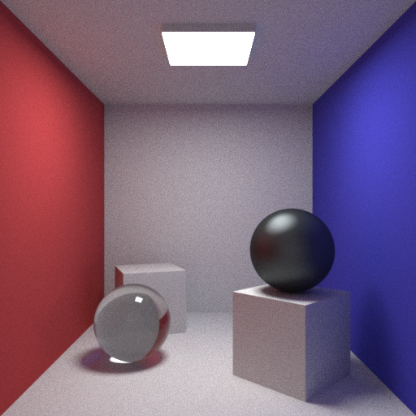

CPPRay
======

A minimalistic pathtracer written in C++, inspiration taken from projects like [smallpt](http://kevinbeason.com/smallpt/).

Example Images:
---------------

_512x512 render @ 1000SPPX, .obj meshes_

_512x512 render @ 200SPPX, Cook-torrance microfacet brdf model for glossy specular materials_

_512x512 render @ 1000SPPX, Glossy floor, triangles implemented_
