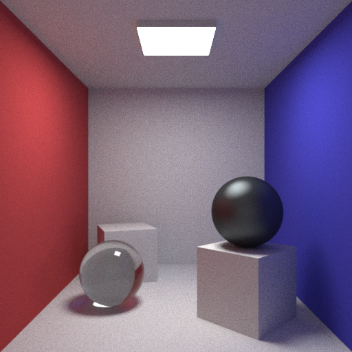

CPPRay
======

A minimalistic path tracer written in C++, inspiration taken from projects like [smallpt](http://kevinbeason.com/smallpt/).

Example Images:
---------------

_512x512 render @ 1000SPPX - Custom cornell box._

")

_512x512 render @ 1000SPPX - Cornell box (C++Ray)_

")

_512x512 - Cornell box (Original)_